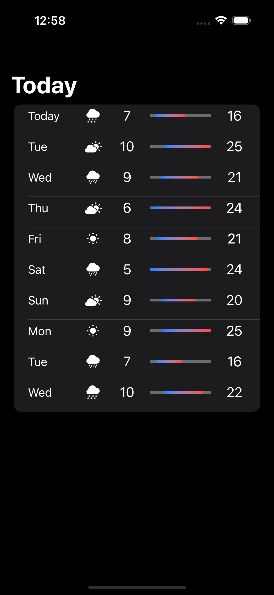

## Mini Weather

Mini Weather is a simple weather app that uses `WeatherKit` to get the current weather for a given city.

### Screenshots

|         Dashboard          |           Detail           |
| :------------------------: | :------------------------: |
|  |  |

## Requirements

- iOS 16.0+
- Xcode 13.0+

## Notes

> WeatherKit has required membership in the Apple Developer Program.
> For development purposes, I have used a mock data provider that returns a random weather forecast.
